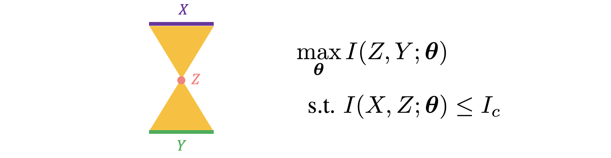

# Awesome Information Bottleneck Paper List  

*In memory of Professor Naftali Tishby.*
 

## 0. Introduction

**To learn, you must forget**. This may probably be one of the most intuitive lessons we have from Naftali Tishby's Information Bottleneck (IB) methods, which grew out of the fundamental tradeoff (rate *v.s.* distortion) from Claude Shannon's information theory, and later creatively explained the learning behaviors of deep neural networks by the fitting & compression framework.

It has been four years since the dazzling talk on [Opening the Black Box of Deep Neural Networks](https://www.youtube.com/watch?v=FSfN2K3tnJU), and more than twenty years since the [first paper](https://arxiv.org/abs/physics/0004057) on the Information Bottleneck method. It is time for us to take a look back, to celebrate what has been established, and to prepare for a future.

This repository is organized as follows:
- [Classics](#1-classics)
- [Reviews](#2-reviews)
- [Theories](#3-theories)
- [Models](#4-models)
- [Applications](#5-applications)
- [Other Information Theory Driven Work](#6-other-information-theory-driven-work) (verbose)

All papers are selected and sorted by topic/conference/year/importance. Please send a pull request if you would like to add any paper.

I also made [slides on theory, applications and controversy](https://github.com/ZIYU-DEEP/Awesome-Information-Bottleneck/blob/main/IB-Intro-Ye.pdf) for the initial Information Bottleneck principle in deep learning (*p.s.*, some controversy has been addressed by recent publications, *e.g.*, [Lorenzen et al., 2021](http://arxiv.org/abs/2106.12912v1)).

*This repository is last updated on September 2021.*

## 1. Classics
**Agglomerative Information Bottleneck** [[link](https://papers.nips.cc/paper/1999/file/be3e9d3f7d70537357c67bb3f4086846-Paper.pdf)] \
Noam Slonim, Naftali Tishby\
*NIPS, 1999*
 

🐤 **The Information Bottleneck Method** [[link](https://arxiv.org/abs/physics/0004057)] \
Naftali Tishby, Fernando C. Pereira, William Bialek\
*Preprint, 2000*
 

**Predictability, complexity and learning** [[link](https://pubmed.ncbi.nlm.nih.gov/11674845/)] \
William Bialek, Ilya Nemenman, Naftali Tishby\
*Neural Computation, 2001*
 

**Sufficient Dimensionality Reduction: A novel analysis principle** [[link](https://www.cs.huji.ac.il/labs/learning/Papers/sdr_ICML.pdf)] \
Amir Globerson, Naftali Tishby\
*ICML, 2002*
 

**The information bottleneck: Theory and applications** [[link](http://www.yaroslavvb.com/papers/slonim-information.pdf)] \
Noam Slonim\
*PhD Thesis, 2002*
 

**An Information Theoretic Tradeoff between Complexity and Accuarcy** [[link](https://www.cs.huji.ac.il/labs/learning/Papers/ib_theory.pdf)] \
Ran Gilad-Bachrach, Amir Navot, Naftali Tishby\
*COLT, 2003*
 

**Information Bottleneck for Gaussian Variables** [[link](https://www.cs.huji.ac.il/labs/learning/Papers/GIB_JMLR2004.pdf)] \
Gal Chechik, Amir Globerson, Naftali Tishby, Yair Weiss\
*NIPS, 2003*
 

**Information and Fitness** [[link](https://www.cs.huji.ac.il/labs/learning/Papers/info+fitness.pdf)] \
Samuel F. Taylor, Naftali Tishby and William Bialek\
*Preprint, 2007*
 

**Efficient representation as a design principle for neural coding and computation** [[link](https://arxiv.org/abs/0712.4381)] \
William Bialek, Rob R. de Ruyter van Steveninck, and Naftali Tishby\
*Preprint, 2007*
 

**The Information Bottleneck Revisited or How to Choose a Good Distortion Measure** [[link](https://www.cs.huji.ac.il/labs/learning/Papers/flaske2.pdf)] \
Peter Harremoes and Naftali Tishby\
*ISIT, 2007*
 

🐤 **Learning and Generalization with the Information Bottleneck** [[link](https://www.cs.huji.ac.il/labs/learning/Papers/ibgen_full.pdf)] \
Ohad Shamir, Sivan Sabato, Naftali Tishby\
*Journal of Theoretical Computer Science, 2009*
 

🐤 **Information-Theoretic Bounded Rationality** [[link](https://arxiv.org/abs/1512.06789)] \
Pedro A. Ortega, Daniel A. Braun, Justin Dyer, Kee-Eung Kim, Naftali Tishby\
*Preprint, 2015*
 

🐤 **Opening the Black Box of Deep Neural Networks via Information** [[link](https://arxiv.org/abs/1703.00810)] \
Ravid Shwartz-Ziv, Naftali Tishby\
*ICRI, 2017*
 

## 2. Reviews
**Information Bottleneck and its Applications in Deep Learning** [[link](https://arxiv.org/abs/1904.03743)] \
Hassan Hafez-Kolahi, Shohreh Kasaei\
*Preprint, 2019*
 

**The Information Bottleneck Problem and Its Applications in Machine Learning** [[link](https://arxiv.org/abs/2004.14941)] \
Ziv Goldfeld, Yury Polyanskiy\
*Preprint, 2020*
 

**On the Information Bottleneck Problems: Models, Connections, Applications and Information Theoretic Views** [[link](https://www.mdpi.com/1099-4300/22/2/151)] \
Abdellatif Zaidi, Iñaki Estella-Aguerri, Shlomo Shamai\
*Entropy, 2020*
 

**Information Bottleneck: Theory and Applications in Deep Learning** [[link](https://www.mdpi.com/1099-4300/22/12/1408)] \
Bernhard C. Geiger, Gernot Kubin\
*Entropy, 2020*
 

**A Critical Review of Information Bottleneck Theory and its Applications to Deep Learning** [[link](https://arxiv.org/abs/2105.04405v1)] \
Mohammad Ali Alomrani\
*Preprint, 2021*
 

## 3. Theories
**Gaussian Lower Bound for the Information Bottleneck Limit** [[link](https://www.jmlr.org/papers/volume18/17-398/17-398.pdf)] \
Amichai Painsky, Naftali Tishby\
*JMLR, 2017*
 

**Caveats for information bottleneck in deterministic scenarios** [[link](https://arxiv.org/abs/1808.07593)] [[ICLR version](https://openreview.net/forum?id=rke4HiAcY7)]\
Artemy Kolchinsky, Brendan D. Tracey, Steven Van Kuyk\
*UAI, 2018*
 

🐤 **On the Information Bottleneck Theory of Deep Learning** [[link](https://openreview.net/forum?id=ry_WPG-A-)] \
Andrew Michael Saxe, Yamini Bansal, Joel Dapello, Madhu Advani, Artemy Kolchinsky, Brendan Daniel Tracey, David Daniel Cox\
*ICLR, 2018*
 

🐤 **The Dual Information Bottleneck** [[link](https://arxiv.org/abs/2006.04641v1)] \
Zoe Piran, Ravid Shwartz-Ziv, Naftali Tishby\
*Preprint, 2019*
 

🐤 **Learnability for the Information Bottleneck** [[link](https://arxiv.org/abs/1907.07331)] [[slides](https://docs.google.com/presentation/d/1sBYA6V-mL6cwYxEWxA5oMDOKYEq1FIjvZ3jOoXDlVD8/edit?usp=sharing)] [[poster](https://docs.google.com/presentation/d/1jkMxI7j8YXTxtUdy9PAtRfYRaLvFdT7hI1qP9m-qDbE/edit?usp=sharing)] [[journal version](https://www.mdpi.com/1099-4300/21/10/924)] [[workshop version](https://openreview.net/forum?id=SJePKo5HdV)] \
Tailin Wu, Ian Fischer, Isaac L. Chuang, Max Tegmark\
*UAI, 2019*
 

🐤 **Phase Transitions for the Information Bottleneck in Representation Learning** [[link](https://openreview.net/forum?id=HJloElBYvB)] [[video](https://media.mis.mpg.de/mml/2021-02-04)] \
Tailin Wu, Ian Fischer\
*ICLR, 2020*
 

**Bottleneck Problems: Information and Estimation-Theoretic View** [[link](http://arxiv.org/abs/2011.06208v1)] \
Shahab Asoodeh, Flavio Calmon\
*Preprint, 2020*
 

🐤 **Information Bottleneck: Exact Analysis of (Quantized) Neural Networks** [[link](http://arxiv.org/abs/2106.12912v1)] \
Stephan Sloth Lorenzen, Christian Igel, Mads Nielsen\
*Preprint, 2021*
> - This paper shows that **different ways of binning** when **computing the mutual information** leads to qualitatively different results.
> - It then confirms then original IB paper's results of the **fitting & compression** phase using quantized nets with exact computation for mutual information.

 

**Perturbation Theory for the Information Bottleneck** [[link](http://arxiv.org/abs/2105.13977v1)] \
Vudtiwat Ngampruetikorn, David J. Schwab\
*Preprint, 2021*
 

## 4. Models
**Deep Variational Information Bottleneck** [[link](https://openreview.net/forum?id=HyxQzBceg)] \
Alexander A. Alemi, Ian Fischer, Joshua V. Dillon, Kevin Murphy\
*ICLR, 2017*
 

**The Deterministic Information Bottleneck** [[link](https://direct.mit.edu/neco/article/29/6/1611/8273/The-Deterministic-Information-Bottleneck)] [[UAI Version](https://www.auai.org/uai2016/proceedings/papers/319.pdf)] \
DJ Strouse, David J. Schwab\
*Neural Computation, 2017*
> This replaces the mutual information term with entropy in the original IB objective.

 

**Learning Sparse Latent Representations with the Deep Copula Information Bottleneck** [[link](https://openreview.net/forum?id=Hk0wHx-RW)] \
Aleksander Wieczorek, Mario Wieser, Damian Murezzan, Volker Roth \
*ICLR, 2018*
 

**Generalization in Reinforcement Learning with Selective Noise Injection and Information Bottleneck** [[link](https://papers.nips.cc/paper/2019/hash/e2ccf95a7f2e1878fcafc8376649b6e8-Abstract.html)] \
Maximilian Igl, Kamil Ciosek, Yingzhen Li, Sebastian Tschiatschek, Cheng Zhang, Sam Devlin, Katja Hofmann\
*NeurIPS, 2019*
 

**Information bottleneck through variational glasses** [[link](http://bayesiandeeplearning.org/2019/papers/75.pdf)]\
Slava Voloshynovskiy, Mouad Kondah, Shideh Rezaeifar, Olga Taran, Taras Holotyak, Danilo Jimenez Rezende\
*NeurIPS Bayesian Deep Learning Workshop, 2019*
 

🐤 **Variational Discriminator Bottleneck** [[link](https://openreview.net/forum?id=HyxPx3R9tm)] \
Xue Bin Peng, Angjoo Kanazawa, Sam Toyer, Pieter Abbeel, Sergey Levine\
*ICLR, 2019*
 

**Nonlinear Information Bottleneck** [[link](https://www.mdpi.com/1099-4300/21/12/1181)] \
Artemy Kolchinsky, Brendan Tracey, David Wolpert\
*Entropy, 2019*
> This formuation shows better performance than VIB.

 

**General Information Bottleneck Objectives and their Applications to Machine Learning** [[link](https://arxiv.org/pdf/1912.06248.pdf)] \
Sayandev Mukherjee\
*Preprint, 2019*
> This paper synthesize IB and Predictive IB, and provides a new variational bound.

 

🐤 **Graph Information Bottleneck** [[link](https://arxiv.org/abs/2010.12811)] [[code](https://github.com/snap-stanford/GIB)] [[slides](https://docs.google.com/presentation/d/1yGs6kfaFHKlZdu0REuSpZTN4Pqt7b0bAnh2y8lvYm3A/edit)] \
Tailin Wu, Hongyu Ren, Pan Li, Jure Leskovec,\
*NeurIPS, 2020*
 

🐤 **Learning Optimal Representations with the Decodable Information Bottleneck** [[link](https://papers.nips.cc/paper/2020/hash/d8ea5f53c1b1eb087ac2e356253395d8-Abstract.html)] \
Yann Dubois, Douwe Kiela, David J. Schwab, Ramakrishna Vedantam\
*NeurIPS, 2020*
 

🐤 **Concept Bottleneck Models** [[link](https://arxiv.org/abs/2007.04612v3)] \
Pang Wei Koh, Thao Nguyen, Yew Siang Tang, Stephen Mussmann, Emma Pierson, Been Kim, Percy Liang\
*ICML, 2020*
 

**Disentangled Representations for Sequence Data using Information Bottleneck Principle** [[link](http://proceedings.mlr.press/v129/yamada20a.html)] [[talk](https://papertalk.org/papertalks/13911)] \
Masanori Yamada, Heecheol Kim, Kosuke Miyoshi, Tomoharu Iwata, Hiroshi Yamakawa\
*ICML, 2020*
 

🐤 **IBA: Restricting the Flow: Information Bottlenecks for Attribution** [[link](https://openreview.net/forum?id=S1xWh1rYwB)] [[code](https://github.com/BioroboticsLab/IBA)] \
Karl Schulz, Leon Sixt, Federico Tombari, Tim Landgraf\
*ICLR, 2020*
 

**On the Difference between the Information Bottleneck and the Deep Information Bottleneck** [[link](https://www.mdpi.com/1099-4300/22/2/131)] \
Aleksander Wieczorek, Volker Roth\
*Entropy, 2020*
 

**The Convex Information Bottleneck Lagrangian** [[link](http://arxiv.org/abs/1911.11000v2)] \
Borja Rodríguez Gálvez, Ragnar Thobaben, Mikael Skoglund\
*Preprint, 2020*
 

**Disentangled Information Bottleneck** [[link](https://www.google.com/url?sa=t&rct=j&q=&esrc=s&source=web&cd=&cad=rja&uact=8&ved=2ahUKEwjhjduUk_vyAhVZ6XMBHQlpBPoQFnoECAQQAQ&url=https%3A%2F%2Fojs.aaai.org%2Findex.php%2FAAAI%2Farticle%2Fview%2F17120%2F16927&usg=AOvVaw1yu4FBl7RBV1xGUgh21VmY)] [[code](https://github.com/PanZiqiAI/disentangled-information-bottleneck)] \
Ziqi Pan, Li Niu, Jianfu Zhang, Liqing Zhang\
*AAAI, 2021*
 

🐤 **IB-GAN: Disentangled Representation Learning** [[link](https://ojs.aaai.org/index.php/AAAI/article/view/16967)] [[code](https://github.com/insuj3on/IB-GAN)][[talk](https://papertalk.org/papertalks/30379)]\
Insu Jeon, Wonkwang Lee, Myeongjang Pyeon, Gunhee Kim\
*AAAI, 2021*
> This model add additional IB constraint based on InfoGAN.

 

**Deciding What to Learn: A Rate-Distortion Approach** [[link](https://arxiv.org/abs/2101.06197v3)] \
Dilip Arumugam, Benjamin Van Roy\
*ICML, 2021*
 

**Invariance Principle Meets Information Bottleneck for Out-of-Distribution Generalization** [[link](http://arxiv.org/abs/2106.06607v1)] \
Kartik Ahuja, Ethan Caballero, Dinghuai Zhang, Yoshua Bengio, Ioannis Mitliagkas, Irina Rish\
*Preprint, 2021*
 

**Multi-Task Variational Information Bottleneck** [[link](http://arxiv.org/abs/2007.00339v4)] \
Weizhu Qian, Bowei Chen, Yichao Zhang, Guanghui Wen, Franck Gechter\
*Preprint, 2021*
 

## 5. Applications
🐤 **Analyzing neural codes using the information bottleneck method** [[link](https://www.cs.huji.ac.il/labs/learning/Papers/nips01_sub.pdf)] \
Elad Schneidman, Noam Slonim, Naftali Tishby, Rob R. deRuyter van Steveninck, William Bialek\
*NIPS, 2001*
 

**Past-future information bottleneck in dynamical systems** [[link](https://journals.aps.org/pre/abstract/10.1103/PhysRevE.79.041925)] \
Felix Creutzig, Amir Globerson, Naftali Tishby\
*Physical Review, 2009*
 

🐤 **InfoBot: Transfer and Exploration via the Information Bottleneck** [[link](https://openreview.net/forum?id=rJg8yhAqKm)] \
Anirudh Goyal, Riashat Islam, DJ Strouse, Zafarali Ahmed, Hugo Larochelle, Matthew Botvinick, Yoshua Bengio, Sergey Levine\
*ICLR, 2018*
 

**Compressing Neural Networks using the Variational Information Bottleneck** [[link](http://proceedings.mlr.press/v80/dai18d.html)] \
Bin Dai, Chen Zhu, Baining Guo, David Wipf \
*ICML, 2018*
 

🐤 **InfoMask: Masked Variational Latent Representation to Localize Chest Disease** [[link](https://arxiv.org/abs/1903.11741)] \
Saeid Asgari Taghanaki, Mohammad Havaei, Tess Berthier, Francis Dutil, Lisa Di Jorio, Ghassan Hamarneh, Yoshua Bengio\
*MICCAI, 2019*
> Be aware how this differs from the [IBA](https://openreview.net/forum?id=S1xWh1rYwB) paper.

 

**Past–future information bottleneck for sampling molecular reaction coordinate simultaneously with thermodynamics and kinetics** [[link](https://www.nature.com/articles/s41467-019-11405-4)] \
Yihang Wang, João Marcelo Lamim Ribeiro, Pratyush Tiwary\
*Nature Communications, 2019*
 

**Kernelized information bottleneck leads to biologically plausible 3-factor Hebbian learning in deep networks** [[link](https://papers.nips.cc/paper/2020/hash/517f24c02e620d5a4dac1db388664a63-Abstract.html)] \
Roman Pogodin, Peter Latham\
*NeurIPS, 2020*
 

**Training Normalizing Flows with the Information Bottleneck for Competitive Generative Classification** [[link](https://papers.nips.cc/paper/2020/hash/593906af0d138e69f49d251d3e7cbed0-Abstract.html)] \
Lynton Ardizzone, Radek Mackowiak, Carsten Rother, Ullrich Köthe\
*NeurIPS, 2020*
 

**Unsupervised Speech Decomposition via Triple Information Bottleneck** [[link](https://proceedings.mlr.press/v119/qian20a.html)] [[code](https://github.com/auspicious3000/SpeechSplit)] \
Kaizhi Qian, Yang Zhang, Shiyu Chang, Mark Hasegawa-Johnson, David Cox\
*ICML, 2020*
 

**Learning Efficient Multi-agent Communication: An Information Bottleneck Approach** [[link](https://proceedings.mlr.press/v119/wang20i.html)] \
Rundong Wang, Xu He, Runsheng Yu, Wei Qiu, Bo An, Zinovi Rabinovich\
*ICML, 2020*
 

🐤 **Inserting Information Bottlenecks for Attribution in Transformers** [[link](https://arxiv.org/abs/2012.13838v2)] \
Zhiying Jiang, Raphael Tang, Ji Xin, Jimmy Lin\
*EMNLP, 2020*
 

**Information Bottleneck for Estimating Treatment Effects with Systematically Missing Covariates** [[link](https://www.mdpi.com/1099-4300/22/4/389)] \
Sonali Parbhoo, Mario Wieser, Aleksander Wieczorek, and Volker Roth\
*Entropy, 2020*
 

**Variational Information Bottleneck for Unsupervised Clustering: Deep Gaussian Mixture Embedding** [[link](http://arxiv.org/abs/1905.11741v3)] \
Yigit Ugur, George Arvanitakis, Abdellatif Zaidi\
*Entropy, 2020*
 

**Learning to Learn with Variational Information Bottleneck for Domain Generalization** [[link](http://arxiv.org/abs/2007.07645v1)] \
Yingjun Du, Jun Xu, Huan Xiong, Qiang Qiu, Xiantong Zhen, Cees G. M. Snoek, Ling Shao\
*ECCV, 2020*
 

**The information bottleneck and geometric clustering** [[link](http://arxiv.org/abs/1712.09657v2)] \
DJ Strouse, David J Schwab\
*Preprint, 2020*
 

**Causal learning with sufficient statistics: an information bottleneck approach** [[link](http://arxiv.org/abs/2010.05375v1)] \
Daniel Chicharro, Michel Besserve, Stefano Panzeri\
*Preprint, 2020*
 

**Learning Robust Representations via Multi-View Information Bottleneck** [[link](http://arxiv.org/abs/2002.07017v2)] \
Marco Federici, Anjan Dutta, Patrick Forré, Nate Kushman, Zeynep Akata\
*Preprint, 2020*
 

**Dynamics Generalization via Information Bottleneck in Deep Reinforcement Learning** [[link](https://arxiv.org/abs/2008.00614)] [[report](https://www2.eecs.berkeley.edu/Pubs/TechRpts/2020/EECS-2020-56.pdf)] \
Yue Jin, Shuangqing Wei, Jian Yuan, Xudong Zhang\
*Preprint, 2020*
 

🐤 **Information Bottleneck Disentanglement for Identity Swapping** [[link](https://openaccess.thecvf.com/content/CVPR2021/html/Gao_Information_Bottleneck_Disentanglement_for_Identity_Swapping_CVPR_2021_paper.html)] \
Gege Gao, Huaibo Huang, Chaoyou Fu, Zhaoyang Li, Ran He\
*CVPR, 2021*
 

**A Variational Information Bottleneck Based Method to Compress Sequential Networks for Human Action Recognition** [[link](https://openaccess.thecvf.com/content/WACV2021/papers/Srivastava_A_Variational_Information_Bottleneck_Based_Method_to_Compress_Sequential_Networks_WACV_2021_paper.pdf)] \
Ayush Srivastava, Oshin Dutta, Jigyasa Gupta, Sumeet Agarwal, Prathosh AP\
*WACV, 2021*
 

**The Variational Bandwidth Bottleneck: Stochastic Evaluation on an Information Budget** [[link](https://openreview.net/forum?id=Hye1kTVFDS)] \
Anirudh Goyal, Yoshua Bengio, Matthew Botvinick, Sergey Levine\
*ICLR, 2020*
 

**Variational Information Bottleneck for Effective Low-Resource Fine-Tuning** [[link](https://openreview.net/forum?id=kvhzKz-_DMF)] \
 Rabeeh Karimi mahabadi, Yonatan Belinkov, James Henderson \
*ICLR, 2021*
 

**A Variational Information Bottleneck Approach to Multi-Omics Data Integration** [[link](http://arxiv.org/abs/2102.03014v2)] \
Changhee Lee, Mihaela van der Schaar\
*AISTATS, 2021*
 

**Information Bottleneck Approach to Spatial Attention Learning** [[link](http://arxiv.org/abs/2108.03418v1)] \
Qiuxia Lai, Yu Li, Ailing Zeng, Minhao Liu, Hanqiu Sun, Qiang Xu\
*IJCAI, 2021*
 

**Unsupervised Hashing with Contrastive Information Bottleneck** [[link](http://arxiv.org/abs/2105.06138v2)] \
Zexuan Qiu, Qinliang Su, Zijing Ou, Jianxing Yu, Changyou Chen\
*IJCAI, 2021*
 

**Neuron Campaign for Initialization Guided by Information Bottleneck Theory** [[link](http://arxiv.org/abs/2108.06530v1)] \
Haitao Mao, Xu Chen, Qiang Fu, Lun Du, Shi Han, Dongmei Zhang\
*CIKM, 2021*
 

**A Closer Look at the Adversarial Robustness of Information Bottleneck Models** [[link](http://arxiv.org/abs/2107.05712v1)] \
Iryna Korshunova, David Stutz, Alexander A. Alemi, Olivia Wiles, Sven Gowal\
*ICML Workshop on A Blessing in Disguise, 2021*
 

**Information Bottleneck Attribution for Visual Explanations of Diagnosis and Prognosis** [[link](http://arxiv.org/abs/2104.02869v2)] \
Ugur Demir, Ismail Irmakci, Elif Keles, Ahmet Topcu, Ziyue Xu, Concetto Spampinato, Sachin Jambawalikar, Evrim Turkbey, Baris Turkbey, Ulas Bagci\
*Preprint, 2021*
 

**DRIBO: Robust Deep Reinforcement Learning via Multi-View Information Bottleneck** [[link](http://arxiv.org/abs/2102.13268v3)] [[code](https://github.com/JmfanBU/DRIBO)] \
Jiameng Fan, Wenchao Li\
*Preprint, 2021*
> This model by MIB encourages the RL agent to encode only task-relevant information.

 

**State Predictive Information Bottleneck** [[link](https://arxiv.org/abs/2011.10127)] [[code](https://github.com/tiwarylab/State-Predictive-Information-Bottleneck)] \
Dedi Wang, Pratyush Tiwary\
*Preprint, 2021*
 

**Disentangled Variational Information Bottleneck for Multiview Representation Learning** [[link](http://arxiv.org/abs/2105.07599v1)] [[code](https://github.com/feng-bao-ucsf/DVIB)] \
Feng Bao\
*Preprint, 2021*
 

**Invariant Information Bottleneck for Domain Generalization** [[link](http://arxiv.org/abs/2106.06333v2)] \
Bo Li, Yifei Shen, Yezhen Wang, Wenzhen Zhu, Colorado J. Reed, Jun Zhang, Dongsheng Li, Kurt Keutzer, Han Zhao\
*Preprint, 2021*
 

**Information-Bottleneck-Based Behavior Representation Learning for Multi-agent Reinforcement learning** [[link](https://arxiv.org/abs/2109.14188)] \
Yue Jin, Shuangqing Wei, Jian Yuan, Xudong Zhang\
*Preprint, 2021*
 

## 6. Other Information Theory Driven Work
**f-GANs in an Information Geometric Nutshell** [[link](https://papers.nips.cc/paper/2017/hash/2f2b265625d76a6704b08093c652fd79-Abstract.html)] \
Richard Nock, Zac Cranko, Aditya K. Menon, Lizhen Qu, Robert C. Williamson\
*NeurIPS, 2017*
 

**Fully Decentralized Policies for Multi-Agent Systems: An Information Theoretic Approach** [[link](https://papers.nips.cc/paper/2017/hash/8bb88f80d334b1869781beb89f7b73be-Abstract.html)] \
Roel Dobbe, David Fridovich-Keil, Claire Tomlin\
*NeurIPS, 2017*
 

**Information Theoretic Properties of Markov Random Fields, and their Algorithmic Applications** [[link](https://papers.nips.cc/paper/2017/hash/8fb5f8be2aa9d6c64a04e3ab9f63feee-Abstract.html)] \
Linus Hamilton, Frederic Koehler, Ankur Moitra\
*NeurIPS, 2017*
 

**Information-theoretic analysis of generalization capability of learning algorithms** [[link](https://papers.nips.cc/paper/2017/hash/ad71c82b22f4f65b9398f76d8be4c615-Abstract.html)] \
Aolin Xu, Maxim Raginsky\
*NeurIPS, 2017*
 

**Learning Discrete Representations via Information Maximizing Self-Augmented Training** [[link](https://proceedings.mlr.press/v70/hu17b.html)] \
Weihua Hu, Takeru Miyato, Seiya Tokui, Eiichi Matsumoto, Masashi Sugiyama\
*ICML, 2017*
 

🐣 **Nonparanormal Information Estimation** [[link](https://proceedings.mlr.press/v70/singh17a.html)] \
Shashank Singh, Barnabás Póczos\
*ICML, 2017*
> This paper shows how to robustly estimate mutual information using i.i.d. samples from unknown distribution.

 

**Entropy and mutual information in models of deep neural networks** [[link](https://papers.nips.cc/paper/2018/hash/6d0f846348a856321729a2f36734d1a7-Abstract.html)] \
Marylou Gabrié, Andre Manoel, Clément Luneau, jean barbier, Nicolas Macris, Florent Krzakala, Lenka Zdeborová\
*NeurIPS, 2018*
 

**Chaining Mutual Information and Tightening Generalization Bounds** [[link](https://papers.nips.cc/paper/2018/hash/8d7628dd7a710c8638dbd22d4421ee46-Abstract.html)] \
Amir Asadi, Emmanuel Abbe, Sergio Verdu\
*NeurIPS, 2018*
 

**Information Constraints on Auto-Encoding Variational Bayes** [[link](https://papers.nips.cc/paper/2018/hash/9a96a2c73c0d477ff2a6da3bf538f4f4-Abstract.html)] \
Romain Lopez, Jeffrey Regier, Michael I. Jordan, Nir Yosef\
*NeurIPS, 2018*
 

**Adaptive Learning with Unknown Information Flows** [[link](https://papers.nips.cc/paper/2018/hash/9e740b84bb48a64dde25061566299467-Abstract.html)] \
Yonatan Gur, Ahmadreza Momeni\
*NeurIPS, 2018*
 

**Information-based Adaptive Stimulus Selection to Optimize Communication Efficiency in Brain-Computer Interfaces** [[link](https://papers.nips.cc/paper/2018/hash/a3eb043e7bf775de87763e9f8121c953-Abstract.html)] \
Boyla Mainsah, Dmitry Kalika, Leslie Collins, Siyuan Liu, Chandra Throckmorton\
*NeurIPS, 2018*
 

**Information Theoretic Guarantees for Empirical Risk Minimization with Applications to Model Selection and Large-Scale Optimization** [[link](https://proceedings.mlr.press/v80/alabdulmohsin18a.html)] \
Ibrahim Alabdulmohsin\
*ICML, 2018*
 

**Mutual Information Neural Estimation** [[link](https://proceedings.mlr.press/v80/belghazi18a.html)] \
Mohamed Ishmael Belghazi, Aristide Baratin, Sai Rajeshwar, Sherjil Ozair, Yoshua Bengio, Aaron Courville, Devon Hjelm\
*ICML, 2018*
 

**Learning to Explain: An Information-Theoretic Perspective on Model Interpretation** [[link](https://proceedings.mlr.press/v80/chen18j.html)]\
Jianbo Chen, Le Song, Martin Wainwright, Michael Jordan\
*ICML, 2018*
 

**Fast Information-theoretic Bayesian Optimisation** [[link](https://proceedings.mlr.press/v80/ru18a.html)] \
Binxin Ru, Michael A. Osborne, Mark Mcleod, Diego Granziol\
*ICML, 2018*
 

**Locality-Sensitive Hashing for f-Divergences: Mutual Information Loss and Beyond** [[link](https://papers.nips.cc/paper/2019/hash/21b29648a47a45ad16bb0da0c004dfba-Abstract.html)] \
Lin Chen, Hossein Esfandiari, Gang Fu, Vahab Mirrokni\
*NeurIPS, 2019*
 

**Information-Theoretic Confidence Bounds for Reinforcement Learning** [[link](https://papers.nips.cc/paper/2019/hash/411ae1bf081d1674ca6091f8c59a266f-Abstract.html)] \
Xiuyuan Lu, Benjamin Van Roy\
*NeurIPS, 2019*
 

**L-DMI: A Novel Information-theoretic Loss Function for Training Deep Nets Robust to Label Noise** [[link](https://papers.nips.cc/paper/2019/hash/8a1ee9f2b7abe6e88d1a479ab6a42c5e-Abstract.html)] \
Yilun Xu, Peng Cao, Yuqing Kong, Yizhou Wang\
*NeurIPS, 2019*
 

**Connections Between Mirror Descent, Thompson Sampling and the Information Ratio** [[link](https://papers.nips.cc/paper/2019/hash/92cf3f7ef90630755b955924254e6ec4-Abstract.html)] \
Julian Zimmert, Tor Lattimore\
*NeurIPS, 2019*
 

**Region Mutual Information Loss for Semantic Segmentation** [[link](https://papers.nips.cc/paper/2019/hash/a67c8c9a961b4182688768dd9ba015fe-Abstract.html)] \
Shuai Zhao, Yang Wang, Zheng Yang, Deng Cai\
*NeurIPS, 2019*
 

**Learning Representations by Maximizing Mutual Information Across Views** [[link](https://papers.nips.cc/paper/2019/hash/ddf354219aac374f1d40b7e760ee5bb7-Abstract.html)]\
Philip Bachman, R Devon Hjelm, William Buchwalter\
*NeurIPS, 2019*
 

**Icebreaker: Element-wise Efficient Information Acquisition with a Bayesian Deep Latent Gaussian Model** [[link](https://papers.nips.cc/paper/2019/hash/c055dcc749c2632fd4dd806301f05ba6-Abstract.html)] \
Wenbo Gong, Sebastian Tschiatschek, Sebastian Nowozin, Richard E. Turner, José Miguel Hernández-Lobato, Cheng Zhang\
*NeurIPS, 2019*
 

**Thompson Sampling with Information Relaxation Penalties** [[link](https://papers.nips.cc/paper/2019/hash/e5b294b70c9647dcf804d7baa1903918-Abstract.html)] \
Seungki Min, Costis Maglaras, Ciamac C. Moallemi\
*NeurIPS, 2019*
 

**InfoMax: Learning deep representations by mutual information estimation and maximization** [[link](https://openreview.net/forum?id=Bklr3j0cKX)][[code](https://github.com/rdevon/DIM)] \
R Devon Hjelm, Alex Fedorov, Samuel Lavoie-Marchildon, Karan Grewal, Phil Bachman, Adam Trischler, Yoshua Bengio\
*ICLR, 2019*
 

**Max-MIG: an Information Theoretic Approach for Joint Learning from Crowds** [[link](https://openreview.net/forum?id=BJg9DoR9t7)] \
Peng Cao, Yilun Xu, Yuqing Kong, Yizhou Wang\
*ICLR, 2019*
 

**Information-Directed Exploration for Deep Reinforcement Learning** [[link](https://openreview.net/forum?id=Byx83s09Km)] \
Nikolay Nikolov, Johannes Kirschner, Felix Berkenkamp, Andreas Krause\
*ICLR, 2019*
 

**Soft Q-Learning with Mutual-Information Regularization** [[link](https://openreview.net/forum?id=HyEtjoCqFX)] \
Jordi Grau-Moya, Felix Leibfried, Peter Vrancx\
*ICLR, 2019*
 

**Hierarchical Reinforcement Learning via Advantage-Weighted Information Maximization** [[link](https://openreview.net/forum?id=Hyl_vjC5KQ)] \
Takayuki Osa, Voot Tangkaratt, Masashi Sugiyama\
*ICLR, 2019*
 

**Information Asymmetry in KL-regularized RL** [[link](https://openreview.net/forum?id=S1lqMn05Ym)] \
Alexandre Galashov, Siddhant M. Jayakumar, Leonard Hasenclever, Dhruva Tirumala, Jonathan Schwarz, Guillaume Desjardins, Wojciech M. Czarnecki, Yee Whye Teh, Razvan Pascanu, Nicolas Heess\
*ICLR, 2019*
 

**Adaptive Estimators Show Information Compression in Deep Neural Networks** [[link](https://openreview.net/forum?id=SkeZisA5t7)] \
 Ivan Chelombiev, Conor Houghton, Cian O'Donnell\
*ICLR, 2019*
 

**Information Theoretic lower bounds on negative log likelihood** [[link](https://openreview.net/forum?id=rkemqsC9Fm)] \
Luis A. Lastras-Montaño\
*ICLR, 2019*
 

**New results on information theoretic clustering** [[link](https://proceedings.mlr.press/v97/cicalese19a.html)] [[code](https://github.com/lmurtinho/RatioGreedyClustering/tree/ICML_submission)] \
Ferdinando Cicalese, Eduardo Laber, Lucas Murtinho\
*ICML, 2019*
 

**Estimating Information Flow in Deep Neural Networks** [[link](https://proceedings.mlr.press/v97/goldfeld19a.html)] \
Ziv Goldfeld, Ewout Van Den Berg, Kristjan Greenewald, Igor Melnyk, Nam Nguyen, Brian Kingsbury, Yury Polyanskiy\
*ICML, 2019*
 

🐣 **The information-theoretic value of unlabeled data in semi-supervised learning** [[link](https://proceedings.mlr.press/v97/golovnev19a.html)] \
Alexander Golovnev, David Pal, Balazs Szorenyi\
*ICML, 2019*
 

**EMI: Exploration with Mutual Information** [[link](https://proceedings.mlr.press/v97/kim19a.html)] [[code](https://github.com/snu-mllab/EMI)] \
Hyoungseok Kim, Jaekyeom Kim, Yeonwoo Jeong, Sergey Levine, Hyun Oh Song\
*ICML, 2019*
 

🐣 **On Variational Bounds of Mutual Information** [[link](https://proceedings.mlr.press/v97/poole19a.html)] \
Ben Poole, Sherjil Ozair, Aaron Van Den Oord, Alex Alemi, George Tucker\
*ICML, 2019*
 

**Where is the Information in a Deep Neural Network?** [[link](https://arxiv.org/abs/1905.12213)] \
Alessandro Achille, Giovanni Paolini, Stefano Soatto\
*Preprint, 2020*
 

**Information Maximization for Few-Shot Learning** [[link](https://papers.nips.cc/paper/2020/hash/196f5641aa9dc87067da4ff90fd81e7b-Abstract.html)] \
Malik Boudiaf, Imtiaz Ziko, Jérôme Rony, Jose Dolz, Pablo Piantanida, Ismail Ben Ayed\
*NeurIPS, 2020*
 

**Belief-Dependent Macro-Action Discovery in POMDPs using the Value of Information** [[link](https://papers.nips.cc/paper/2020/hash/7f2be1b45d278ac18804b79207a24c53-Abstract.html)] \
Genevieve Flaspohler, Nicholas A. Roy, John W. Fisher III\
*NeurIPS, 2020*
 

**Predictive Information Accelerates Learning in RL** [[link](https://papers.nips.cc/paper/2020/hash/89b9e0a6f6d1505fe13dea0f18a2dcfa-Abstract.html)] \
Kuang-Huei Lee, Ian Fischer, Anthony Liu, Yijie Guo, Honglak Lee, John Canny, Sergio Guadarrama\
*NeurIPS, 2020*
> "The **predictive information** is the **mutual information** between the *past* and the *future*, $I(X_{\text{past}}; X_{\text{future}})$."

 

**Information Theoretic Regret Bounds for Online Nonlinear Control** [[link](https://papers.nips.cc/paper/2020/hash/aee5620fa0432e528275b8668581d9a8-Abstract.html)] \
Sham Kakade, Akshay Krishnamurthy, Kendall Lowrey, Motoya Ohnishi, Wen Sun\
*NeurIPS, 2020*
 

**Conditioning and Processing: Techniques to Improve Information-Theoretic Generalization Bounds** [[link](https://papers.nips.cc/paper/2020/hash/befe5b0172188ad14d48c3ebe9cf76bf-Abstract.html)] \
Hassan Hafez-Kolahi, Zeinab Golgooni, Shohreh Kasaei, Mahdieh Soleymani\
*NeurIPS, 2020*
 

**Variational Interaction Information Maximization for Cross-domain Disentanglement** [[link](https://papers.nips.cc/paper/2020/hash/fe663a72b27bdc613873fbbb512f6f67-Abstract.html)] \
HyeongJoo Hwang, Geon-Hyeong Kim, Seunghoon Hong, Kee-Eung Kim\
*NeurIPS, 2020*
 

**Information theoretic limits of learning a sparse rule** [[link](https://papers.nips.cc/paper/2020/hash/713fd63d76c8a57b16fc433fb4ae718a-Abstract.html)] \
Clément Luneau, jean barbier, Nicolas Macris\
*NeurIPS, 2020*
 

**Understanding Approximate Fisher Information for Fast Convergence of Natural Gradient Descent in Wide Neural Networks** [[link](https://papers.nips.cc/paper/2020/hash/7b41bfa5085806dfa24b8c9de0ce567f-Abstract.html)] \
Ryo Karakida, Kazuki Osawa\
*NeurIPS, 2020*
 

🐣 **On Mutual Information Maximization for Representation Learning** [[link](https://openreview.net/forum?id=rkxoh24FPH)] \
Michael Tschannen, Josip Djolonga, Paul K. Rubenstein, Sylvain Gelly, Mario Lucic\
*ICLR, 2020*
 

🐣 **Understanding the Limitations of Variational Mutual Information Estimators** [[link](https://openreview.net/forum?id=B1x62TNtDS)] \
Jiaming Song, Stefano Ermon\
*ICLR, 2020*
 

**Expected Information Maximization: Using the I-Projection for Mixture Density Estimation** [[link](https://openreview.net/forum?id=ByglLlHFDS)] \
Philipp Becker, Oleg Arenz, Gerhard Neumann \
*ICLR, 2020*
 

**Mutual Information Gradient Estimation for Representation Learning** [[link](https://openreview.net/forum?id=ByxaUgrFvH)] \
 Liangjian Wen, Yiji Zhou, Lirong He, Mingyuan Zhou, Zenglin Xu\
*ICLR, 2020*
 

**InfoGraph: Unsupervised and Semi-supervised Graph-Level Representation Learning via Mutual Information Maximization** [[link](https://openreview.net/forum?id=r1lfF2NYvH)] \
 Fan-Yun Sun, Jordan Hoffman, Vikas Verma, Jian Tang\
*ICLR, 2020*
 

**A Mutual Information Maximization Perspective of Language Representation Learning** [[link](https://openreview.net/forum?id=Syx79eBKwr)] \
 Lingpeng Kong, Cyprien de Masson d'Autume, Lei Yu, Wang Ling, Zihang Dai, Dani Yogatama\
*ICLR, 2020*
 

**CLUB: A Contrastive Log-ratio Upper Bound of Mutual Information** [[link](https://proceedings.mlr.press/v119/cheng20b.html)] [[code](https://github.com/Linear95/CLUB)] \
Pengyu Cheng, Weituo Hao, Shuyang Dai, Jiachang Liu, Zhe Gan, Lawrence Carin\
*ICML, 2020*
 

**Information Particle Filter Tree: An Online Algorithm for POMDPs with Belief-Based Rewards on Continuous Domains** [[link](https://proceedings.mlr.press/v119/fischer20a.html)] [[code](https://github.com/johannes-fischer/icml2020_ipft)] \
Johannes Fischer, Ömer Sahin Tas\
*ICML, 2020*
 

**Bayesian Experimental Design for Implicit Models by Mutual Information Neural Estimation** [[link](https://proceedings.mlr.press/v119/kleinegesse20a.html)] [[code](https://github.com/stevenkleinegesse/minebed)] \
Steven Kleinegesse, Michael U. Gutmann\
*ICML, 2020*
 

**FR-Train: A Mutual Information-Based Approach to Fair and Robust Training** [[link](https://proceedings.mlr.press/v119/roh20a.html)] [[code](https://github.com/yuji-roh/fr-train)] \
Yuji Roh, Kangwook Lee, Steven Whang, Changho Suh\
*ICML, 2020*
 

**Learning Discrete Structured Representations by Adversarially Maximizing Mutual Information** [[link](https://proceedings.mlr.press/v119/stratos20a.html)] [[code](https://github.com/karlstratos/ammi)] \
Karl Stratos, Sam Wiseman\
*ICML, 2020*
 

**Learning Structured Latent Factors from Dependent Data:A Generative Model Framework from Information-Theoretic Perspective** [[link](https://proceedings.mlr.press/v119/zhang20m.html)] \
Ruixiang Zhang, Masanori Koyama, Katsuhiko Ishiguro\
*ICML, 2020*
 

**Learning Adversarially Robust Representations via Worst-Case Mutual Information Maximization** [[link](https://proceedings.mlr.press/v119/zhu20e.html)] [[code](https://github.com/schzhu/learning-adversarially-robust-representations)] \
Sicheng Zhu, Xiao Zhang, David Evans\
*ICML, 2020*
 

**Usable Information and Evolution of Optimal Representations During Training** [[link](https://openreview.net/forum?id=p8agn6bmTbr)] \
 Michael Kleinman, Alessandro Achille, Daksh Idnani, Jonathan Kao\
*ICLR, 2021*
 

**Domain-Robust Visual Imitation Learning with Mutual Information Constraints** [[link](https://openreview.net/forum?id=QubpWYfdNry)] \
 Edoardo Cetin, Oya Celiktutan\
*ICLR, 2021*
 

**Multi-Class Uncertainty Calibration via Mutual Information Maximization-based Binning** [[link](https://openreview.net/forum?id=AICNpd8ke-m)] \
 Kanil Patel, William H. Beluch, Bin Yang, Michael Pfeiffer, Dan Zhang\
*ICLR, 2021*
 

**Graph Information Bottleneck for Subgraph Recognition** [[link](https://openreview.net/forum?id=bM4Iqfg8M2k)] \
Junchi Yu, Tingyang Xu, Yu Rong, Yatao Bian, Junzhou Huang, Ran He\
*ICLR, 2021*
 

**InfoBERT: Improving Robustness of Language Models from An Information Theoretic Perspective** [[link](https://openreview.net/forum?id=hpH98mK5Puk)]\
 Boxin Wang, Shuohang Wang, Yu Cheng, Zhe Gan, Ruoxi Jia, Bo Li, Jingjing Liu\
*ICLR, 2021*
 

**Bayesian Algorithm Execution: Estimating Computable Properties of Black-box Functions Using Mutual Information** [[link](https://icml.cc/Conferences/2021/Schedule?showEvent=10675)] [[slides](https://icml.cc/media/icml-2021/Slides/10675.pdf)] \
Willie Neiswanger, Ke Alexander Wang, Stefano Ermon\
*ICML, 2021*
 

**Decomposed Mutual Information Estimation for Contrastive Representation Learning** [[link](http://proceedings.mlr.press/v139/sordoni21a/sordoni21a.pdf)] \
Alessandro Sordoni, Nouha Dziri, Hannes Schulz, Geoff Gordon, Philip Bachman, Remi Tachet Des Combes\
*ICML, 2021*
 

**ReduNet: A White-box Deep Network from the Principle of Maximizing Rate Reduction** [[link](https://arxiv.org/abs/2105.10446)] [[code](https://github.com/ryanchankh/ReduNet)] \
Kwan Ho Ryan Chan, Yaodong Yu, Chong You, Haozhi Qi, John Wright, Yi Ma\
*Preprint, 2021*
 

**Intelligence, physics and information – the tradeoff between accuracy and simplicity in machine learning** [[link](https://arxiv.org/abs/2001.03780)] \
Tailin Wu\
*PhD Thesis, 2021*
 

<!-- **** [[link]()] \
\
*Preprint, 2021*
  -->

<!--

**** [[link]()] \
\
**
  -->
